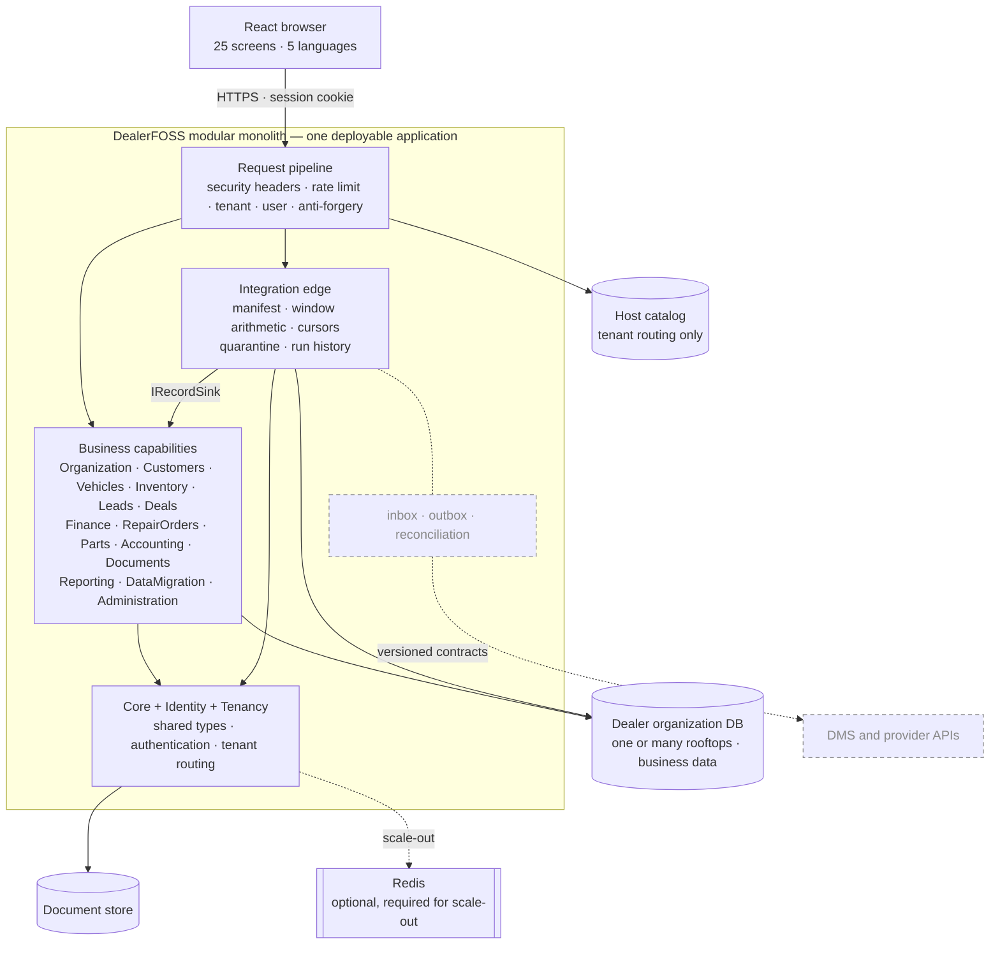

# System Architecture

Specified in [02 — Architecture & Decisions](../02-Architecture-and-Decisions.md).
Dashed and dimmed means designed but not built — see the
[reading note](README.md#reading-them).

One tenant is one dealer organization. Rooftops are scoped business units inside
its database, not separate tenants.

**The integration edge holds no dealership rules.** It reaches a capability only
through `IRecordSink`, and an architecture test fails the build if it references
a capability's entities directly — a connector able to write a deal row would be
a route around every rule Deals enforces, arriving from outside the building.

**Not built:** the durable inbox and outbox, reconciliation, webhooks, and any
connection to a real provider. The edge itself — manifests, window arithmetic,
cursors, quarantine and run history — is built and tested against a fixture
connector that misbehaves on purpose.
