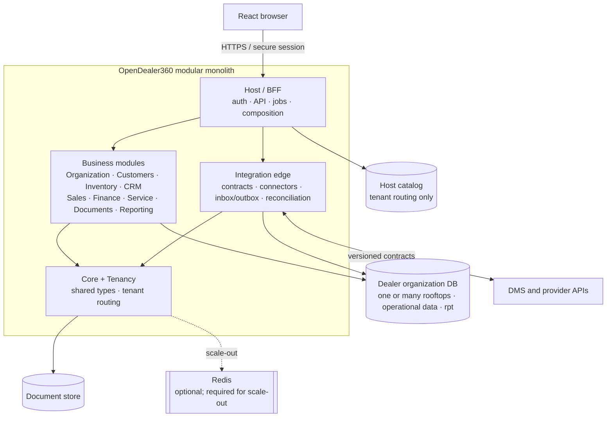

# System Architecture

Specified in [02 — Architecture & Decisions](../02-Architecture-and-Decisions.md).

One tenant is one dealer organization. Rooftops are scoped business units inside its database, not separate tenants.
