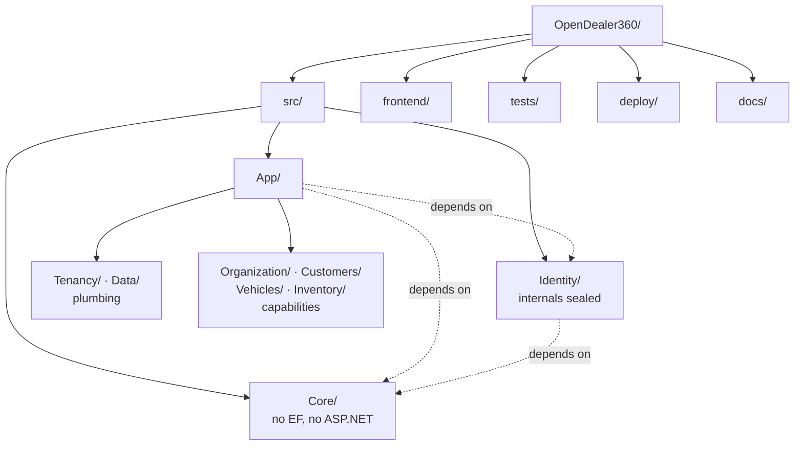
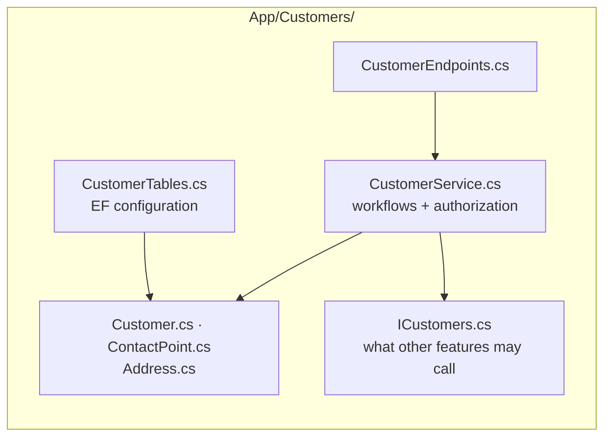
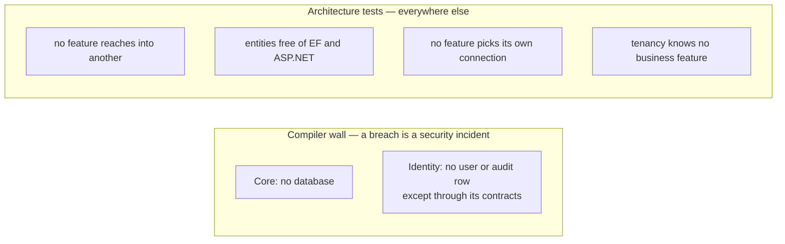

# Project Structure

Specified in [03 — Project Structure](../03-Project-Structure.md), decided in
[ADR-017](../adr/0017-three-projects-flat-features.md).

Three backend projects. Dependencies flow one way only.

Inside a capability, one flat folder with files named by role:

Two walls are compiler-enforced — `Core` and `Identity` are separate projects.
Everything else is held by architecture tests that fail the build on a breach.

