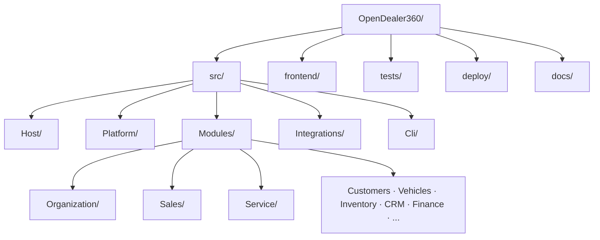
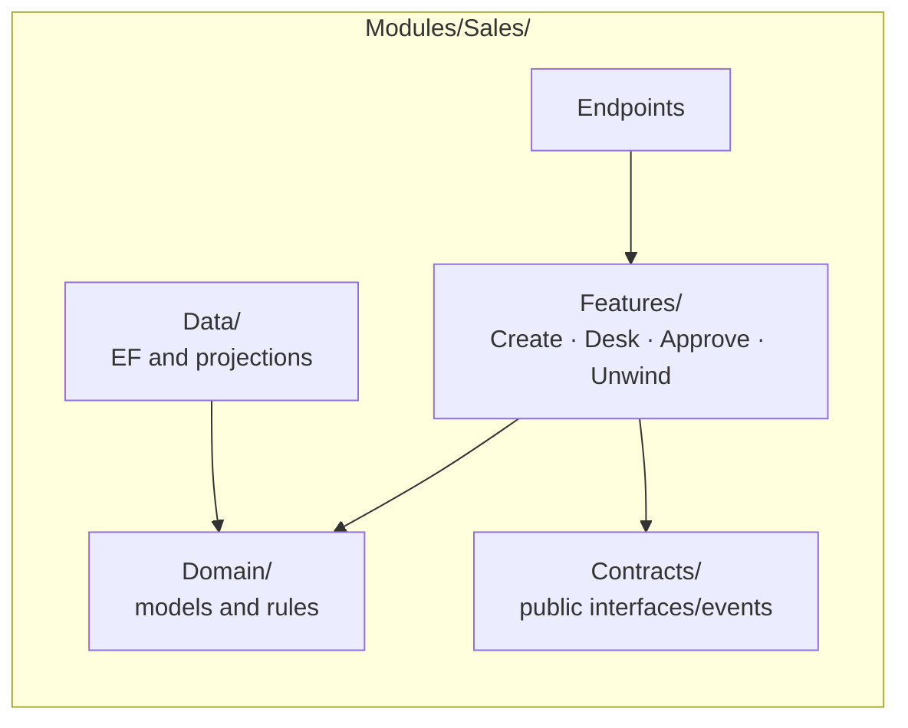

# Project Structure

Specified in [03 — Project Structure](../03-Project-Structure.md).

Small modules remain flat. Large modules use only the structure they need:

Compiler references, architecture tests, and schema-ownership tests enforce the dependency rules.
