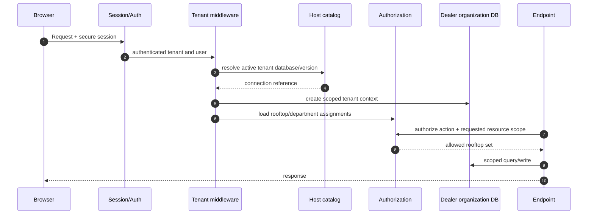

# Tenant and Rooftop Resolution

Specified in [04 — Data & Tenancy](../04-Data-and-Tenancy.md).

A request resolves one dealer organization. It may access one or several rooftops only when the user has explicit scope.
