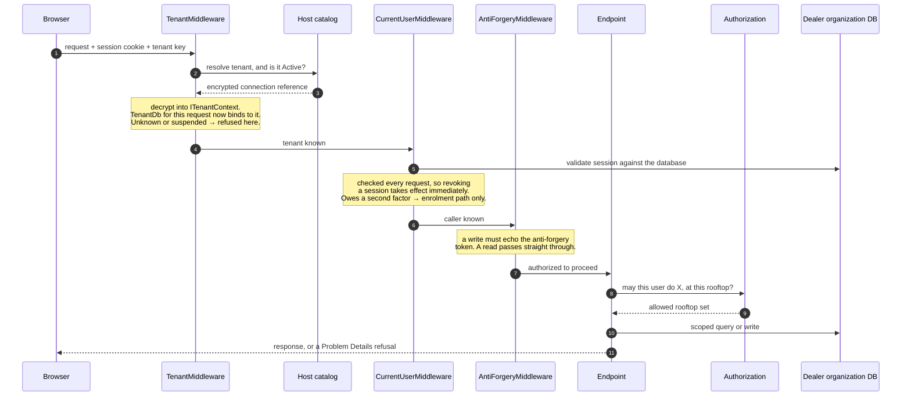

# Tenant and Rooftop Resolution

Specified in [04 — Data & Tenancy](../04-Data-and-Tenancy.md).

**The tenant is resolved before the user, not after.** Sessions and user records
live in the *tenant's own* database, so there is nowhere to look a caller up
until the dealer organization is known. Every step below runs before any
endpoint does.

A request resolves exactly one dealer organization. It reaches one or several
rooftops only where the user has explicit scope.

The isolation is not a filter anyone has to remember. `TenantDb` is constructed
per request from the connection string resolved in step 2, so a query
**physically cannot** address a second organization's database — which is what
`deploy/verify-e2e.ps1` proves end to end.

Work that is not a request — a background import — has no ambient tenant and
must name one through `ITenantScopeFactory`. There is deliberately no "current"
tenant outside a request.
