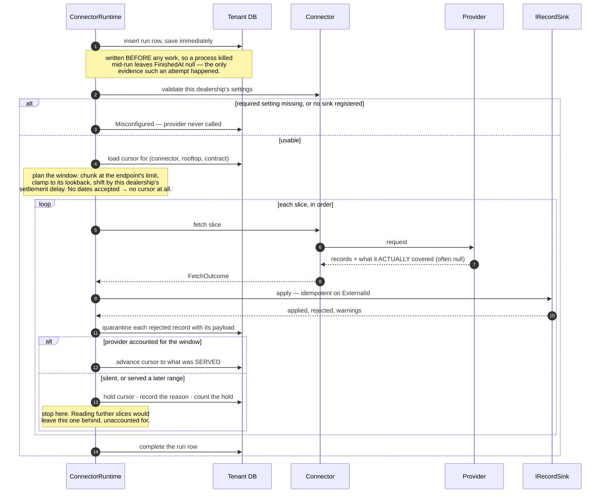
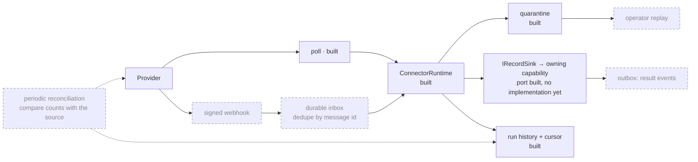

# Integration Flow

Specified in [05 — Integration Framework](../05-Integration-Framework.md).
Dashed and dimmed means designed but not built — see the
[reading note](README.md#reading-them).

## What a run does today

`ConnectorRuntime.RunAsync` reads one dealership's feed. The cursor rules are the
reason this is a diagram rather than a loop.

**The cursor advances from what the provider reported serving, never from what
was requested.** Advancing past a period the provider never served produces no
exception, no warning and no failed run — the hole is found by a reconciliation
months later, when the source no longer holds the data. There is no louder
signal available, so the refusal is the signal.

A held cursor is **not** a failed run. Records arrived and were applied; the
position simply did not move, and the same window is asked for again next time.
That is why `IRecordSink` requires idempotency on the provider's own identifier.

## The wider design

Webhooks, a durable inbox and outbox, replay and reconciliation are specified in
doc 05 §4 and none of them exist.

**Built:** the manifest and its typed settings, window arithmetic, the cursor and
its hold rules, coercion to absence (ADR-021), quarantine with an expiry
(ADR-022), run history, and a fixture connector that misbehaves the way real
providers do — 55 tests across the unit and SQL-backed suites.

**Not built:** any real provider connector, any `IRecordSink` implementation
(so a real deployment reports every run `Misconfigured`), the scheduler that
would start a run, webhooks, the inbox and outbox, replay, reconciliation, the
quarantine purge, and outbound writes.

Deletes will use tombstones and outbound writes will carry an origin ID to
prevent loops. Both are specified; neither is written.
