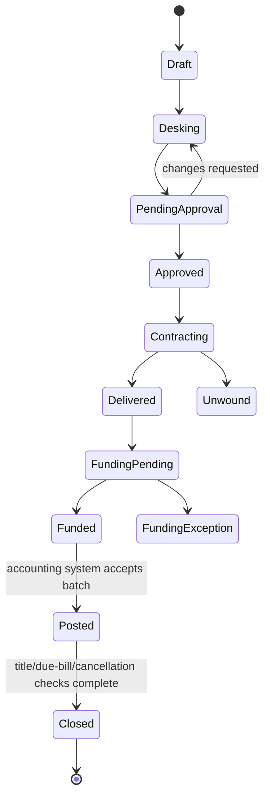

# Deal Lifecycle

Specified in [01 — Vision & Scope](../01-Vision-and-Scope.md) and [06 — Security & API](../06-Security-and-API.md).

A deal has related but separate commercial, funding, title, and accounting states. “Funded” is not the end of every responsibility.

Approval applies to an exact deal version. A material change returns the deal to approval. Funding, title, and accounting status are tracked independently even when the UI presents one overall progress view.
