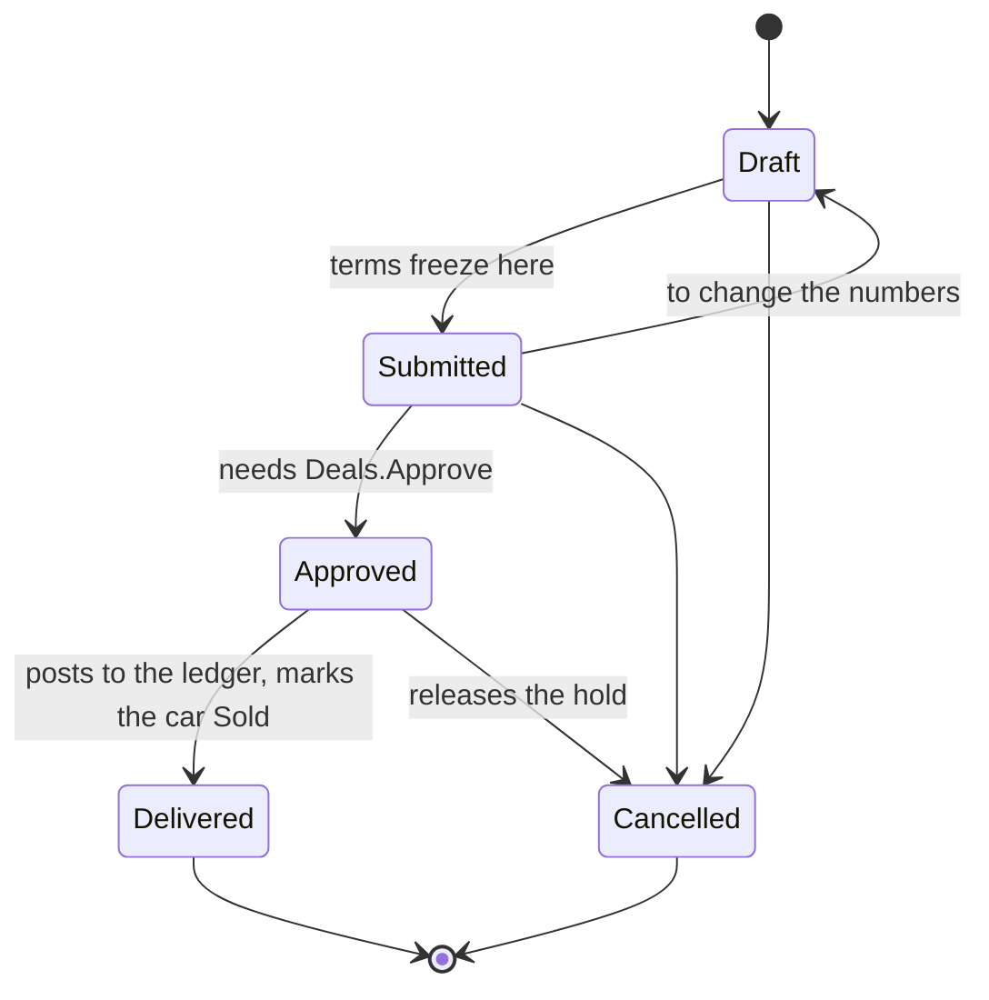
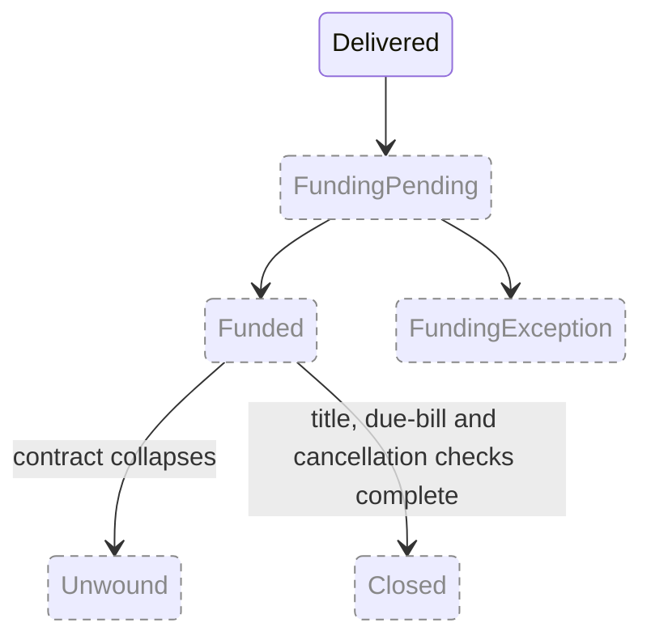

# Deal Lifecycle

Specified in [01 — Vision & Scope](../01-Vision-and-Scope.md) and
[06 — Security & API](../06-Security-and-API.md). Dashed and dimmed means
designed but not built — see the [reading note](README.md#reading-them).

## What is built

Five states, and the transition table in `DealStatusRules` is the authority —
anything not listed there is refused, so Draft cannot jump to Delivered and a
delivered deal is final.

**The Draft boundary is the load-bearing one.** While a deal is Draft its numbers
can be changed freely; from Submitted onwards they are frozen, and changing them
means moving the deal *back* to Draft — which is a recorded move with an author,
not a silent edit. A price that could change after approval would make approval
meaningless.

**Approving is a separate permission from writing.** A salesperson builds the
numbers under `Deals.Write`; somebody holding `Deals.Approve` signs them off, and
a user cannot approve their own deal. That split is the point of the capability,
not decoration.

**Starting a deal holds the car and cancelling releases it**, through
`IInventory`. The deal and the hold commit in one transaction, so they can never
disagree.

## The wider design

Doc 01 §55 scopes funding variance, chargebacks, unwind and product cancellation.
None of that is built: there is no funding state, no title tracking, and no
separate accounting state — delivery posts to the ledger directly.

When these land, funding, title and accounting status are tracked **independently**
of the commercial state, even where the screen presents one overall progress bar.
"Funded" is not the end of every responsibility, and collapsing them into a
single status column is the mistake this note exists to prevent. Sending an
application to a lender needs a lender relationship to test against, so the whole
group is blocked on something other than engineering.
