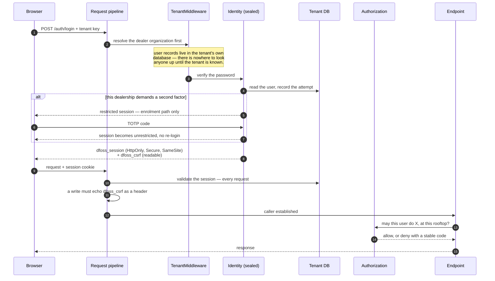
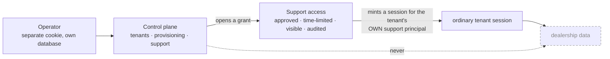

# Authentication and Scope Flow

Specified in [06 — Security & API](../06-Security-and-API.md). Dashed and dimmed
means designed but not built — see the [reading note](README.md#reading-them).

Sessions are **durable, not stateless**: every request revalidates against the
database, so revoking one takes effect immediately rather than whenever a token
would have expired. That trade is deliberate and is the whole reason the sessions
are stored.

The anti-forgery token is a **readable** cookie the browser copies into a header.
That is the entire mechanism: a cross-site form can send our cookies but cannot
set a header.

## Two kinds of administrator, and they are not related

Whoever runs the installation is not a dealership user and **cannot read
dealership data**. This is structural, not a permission: an architecture test
forbids control-plane code from even *referencing* `ICurrentUser`, the type every
capability uses to ask "may this person see this?".

Support access is not an exception to the rule. It issues a session for the
tenant's own support user, which the ordinary middleware then resolves in the
ordinary way — no administrator ever *becomes* a dealership caller. The grant is
visible to the dealership while it is open.

**Not built:** signing in with a company account (OIDC/SSO). It cannot be
honestly built or tested without a real identity provider, and a fake one would
prove nothing. Also missing: a second operator account, and any way for an
operator to recover their own access — there is nobody above them to issue a
code, so it needs a different answer entirely.
