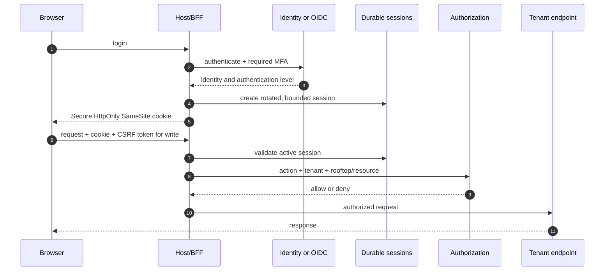

# Authentication and Scope Flow

Specified in [06 — Security & API](../06-Security-and-API.md).

Global administration does not imply tenant-data access. Support access creates a separate, approved, time-limited, visible, and audited tenant session.
