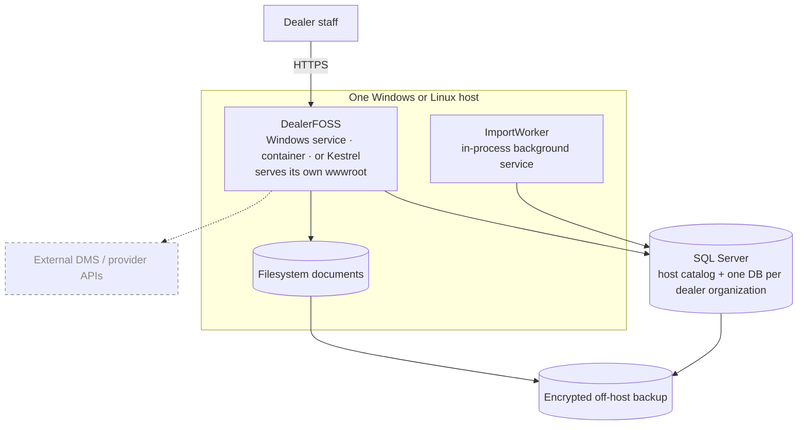
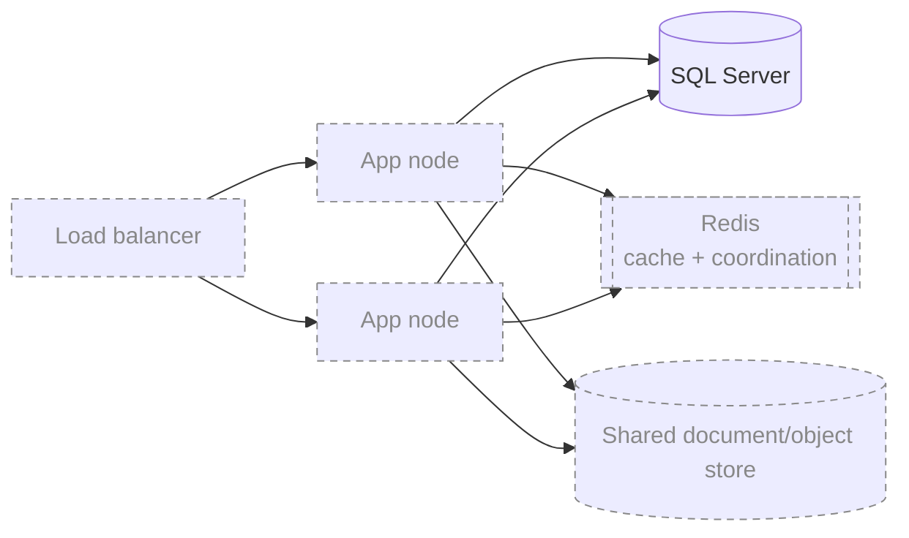

# Deployment Topology

Specified in [07 — Delivery Roadmap](../07-Delivery-Roadmap.md). Dashed and
dimmed means designed but not built — see the
[reading note](README.md#reading-them).

**The application serves its own web interface.** `deploy/publish.ps1` builds the
frontend into `wwwroot` and refuses to produce a package where that folder is
empty, so an installation is one thing rather than an application plus a web
server plus a proxy configuration.

## Small on-premises deployment — what ships today

Redis is not required for this topology, and neither is a job scheduler. The one
piece of background work — importing a CSV — is an in-process
`BackgroundService`. **There is no durable job scheduler**, which is why nothing
currently starts an integration run on a timer.

Two packages exist: a **Windows service**, whose connection string and encryption
key are written into the service's own registry entry rather than machine-wide,
and a **container**. Backups are rehearsed by `deploy/backup.ps1` and
`deploy/restore.ps1`.

> The backup files hold every customer record in readable form. Where they are
> kept, and whether they are encrypted at rest, is a decision about a
> dealership's customers and is deliberately left to the operator rather than
> defaulted.

## Scale-out — designed, not built

Nothing has been run on more than one node, and the pieces that would make it
safe are specified rather than written.

Going multi-node needs three things that do not exist: Redis actually wired in
(ADR-005 keeps it optional), a shared document store instead of the local
filesystem, and a poll lease so two nodes cannot run the same dealership's
integration at once. Performance and load testing have not been started either —
that is scheduled, not skipped.
