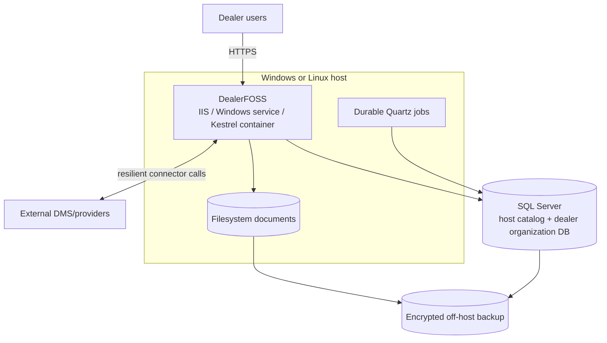
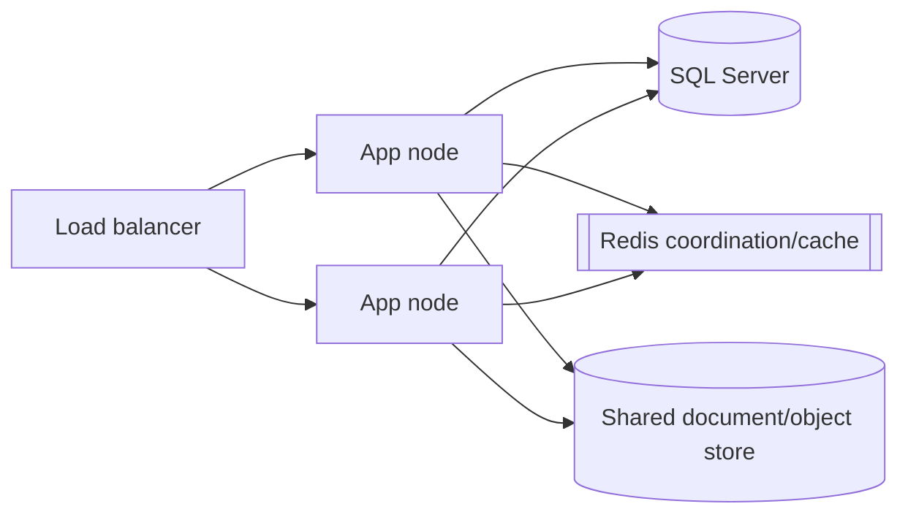

# Deployment Topology

Specified in [07 — Delivery Roadmap](../07-Delivery-Roadmap.md).

## Small on-premises deployment

```mermaid
flowchart TB
    Users["Dealer users"]
    subgraph Host["Windows or Linux host"]
        App["DealerFOSS<br/>IIS / Windows service / Kestrel container"]
        Jobs["Durable Quartz jobs"]
        Docs[("Filesystem documents")]
    end
    SQL[("SQL Server<br/>host catalog + dealer organization DB")]
    Backup[("Encrypted off-host backup")]
    Providers["External DMS/providers"]

    Users -->|HTTPS| App
    App --> SQL
    Jobs --> SQL
    App --> Docs
    App <-->|resilient connector calls| Providers
    SQL --> Backup
    Docs --> Backup
```

Redis is not required for this topology.

## Scale-out option

```mermaid
flowchart LR
    LB["Load balancer"] --> A1["App node"]
    LB --> A2["App node"]
    A1 --> SQL[("SQL Server")]
    A2 --> SQL
    A1 --> Redis[["Redis coordination/cache"]]
    A2 --> Redis
    A1 --> Objects[("Shared document/object store")]
    A2 --> Objects
```
